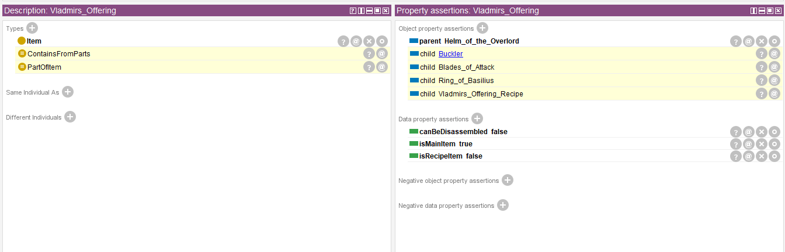
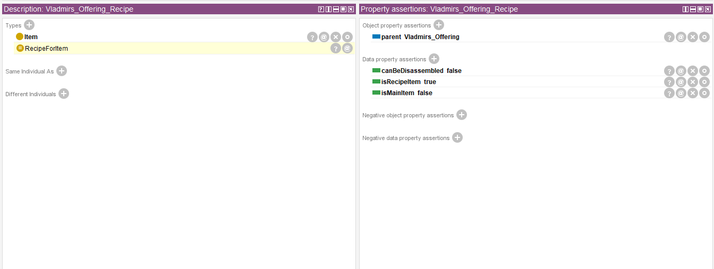
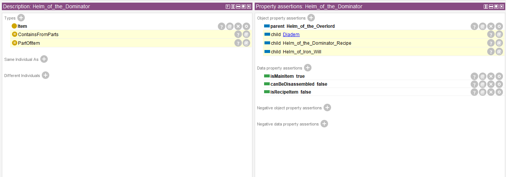
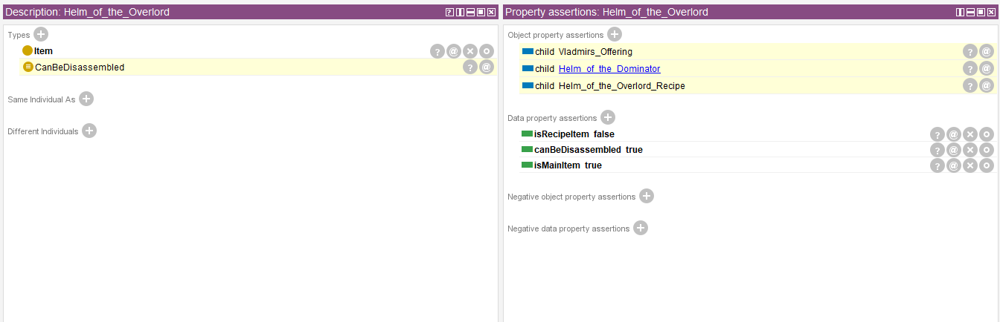
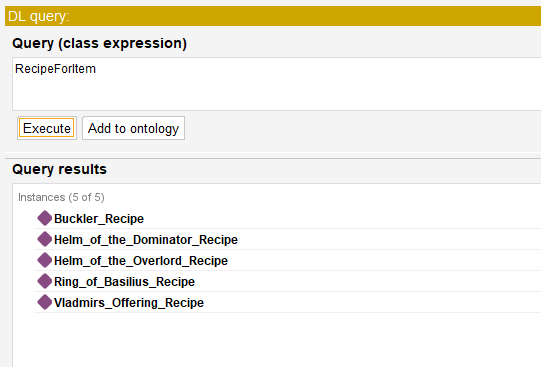
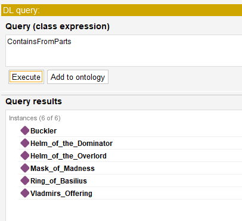
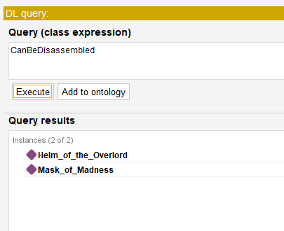

### Лабораторная 2. **Создание онтологии в Protege**

Целью этой лабораторной работы является знакомство со средой разработки онтологий Protege и перевод базы знаний, созданной в предыдущей лабораторной работе в онтологическую форму в Protege.

**Задание**

Преобразовать факты и отношения из Prolog в концепты и свойства в онтологии. Описать классы и свойства в онтологии, которые соответствуют объектам и отношениям из базы знаний. Например, если у были классы "Человек" и "Машина" и свойство "возраст", создайте аналогичные классы и свойства в онтологии в Protege.

**Критерии оценки**

- Корректное создание онтологии в Protege на основе базы знаний в Prolog.
- Качество перевода фактов, предикатов и отношений из Prolog в онтологию.
- Определение классов, свойств и иерархии классов в Protege.
- Тестирование онтологии и демонстрация ее функциональности.

### Информация о созданной онтологии в Protege
Были созданы следующие сущности в онтологии:
- Item
- PartOfItem
- RecipeForItem
- ContainsFromParts
- CanBeDisassembled

К этим сущностям были добавлены "Object Properties":
- parent (задаётся в качестве факта)
- child (правило -> если X - parent Y, то Y - child X)

Также были добавлены "Data Properties":
- canBeDisassembled (boolean range)
- isMainItem (boolean range)
- isRecipeItem (boolean range)

Таким образом, пять изначальных правила были перенесены в Protege следующим образом:\

| Prolog | Protege | Protege Equivalent |
|----------|----------|----------|
| Правило "child" | Object Propery "child" | Inverse of parent |
| Правило "can_be_assembled" | Class "PartOfItem" | child min 1 Item |
| Правило "contains_element" | Class "ContainsFromParts" | parent min 1 Item |
| Правило "can_be_dissasembled_into" | Class "CanBeDisassembled" | (child some Item) and (canBeDisassembled value true) |
| Правило "recipe_for_item" | Class "RecipeForItem" | (parent some Item) and (isRecipeItem value true) |

### Примеры заготовленных объектов онтологии

### Примеры выполнения DL запросов

